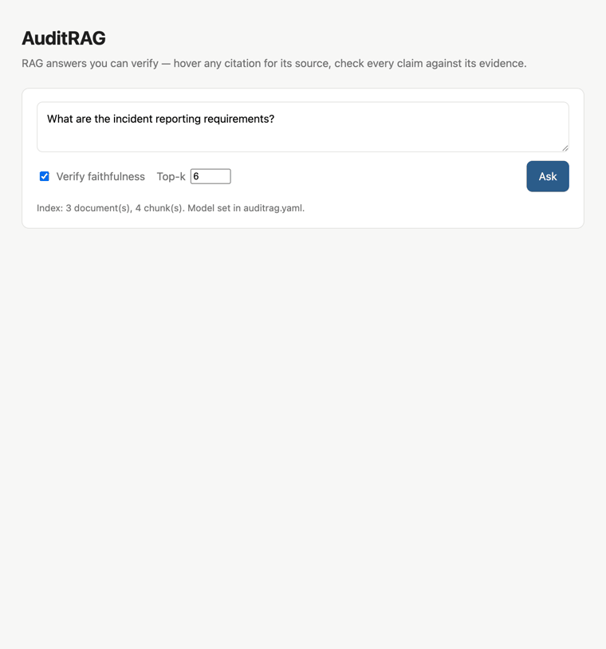
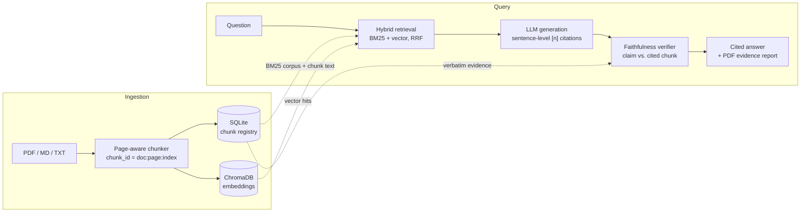

# AuditRAG

[](https://github.com/aryanSharmaGithub/auditRag/actions/workflows/ci.yml)
[](LICENSE)

**RAG answers you can verify — citations, faithfulness checks, and exportable evidence reports.**

<!-- TODO: record demo GIF (ingest → ask → hover citation → export report) -->


> **Status:** early development. Everything except the web UI is shipped and tested: ingestion, hybrid citation-tracked retrieval, cited generation (`ask`), the faithfulness pass (`--verify`), and PDF evidence export (`--export`). The [roadmap](#roadmap) below is the source of truth.

## Why

RAG systems today cite documents, not claims — a link to a 40-page PDF under a paragraph of generated text verifies nothing. Even when frameworks track sources internally, the provenance is usually destroyed in flight: chunk metadata gets dropped between retrieval and generation, and the model is free to assert things its sources never said. AuditRAG treats provenance as the product: every sentence maps to an exact chunk with a page number, a second model checks each claim against its cited evidence, and the whole session exports as a timestamped report you can hand to an auditor.

## Quickstart

```bash
git clone https://github.com/aryanSharmaGithub/auditRag.git auditrag && cd auditrag
pip install -r requirements.txt && pip install -e .

# Index your documents (.pdf, .md, .txt) — no API key needed,
# embeddings run locally by default
auditrag ingest ./docs

# Inspect retrieval quality directly — ranked chunks with file, page, and ID
auditrag search "What is the data retention period?"

# Or run the HTTP API (GET /health, POST /query)
auditrag serve

# Ask a question, get an answer where every sentence cites its source
# (needs an LLM endpoint — set OPENAI_API_KEY, or point llm.base_url at Ollama)
auditrag ask "What is the data retention period?"

# Same, plus a faithfulness pass: every claim is judged against the exact
# text of the chunks it cites — unsupported claims get flagged
auditrag ask --verify "What is the data retention period?"

# Export the whole exchange as a timestamped PDF evidence report:
# claims, verdicts, and the verbatim cited chunks with page numbers
auditrag ask --verify --export evidence.pdf "What is the data retention period?"
```

Requires Python 3.10+. Ingestion is idempotent: unchanged files are skipped, modified files are re-indexed in place.

## Architecture



The diagram shows the full v1 design; the [roadmap](#roadmap) tracks which stages are shipped. Three invariants make the citations trustworthy:

- **Chunk IDs are minted once and never regenerated.** `{doc_hash}:{page}:{chunk_index}` is deterministic, human-decodable, and survives every pipeline stage. The LLM only ever sees small integer labels; the label→ID map lives in request scope, so a hallucinated citation is detected, not resolved.
- **SQLite is the source of truth for chunk content.** ChromaDB holds embeddings keyed by the same IDs, nothing more. Citation resolution and evidence reports never depend on vector-store internals.
- **Chunks never cross page boundaries.** Every citation carries a single exact page number, and `page_text[start_char:end_char] == chunk.text` is enforced by tests.

No LangChain. Every hop is a plain typed function exchanging Pydantic models — for a tool whose pitch is "audit this," the pipeline itself has to be auditable.

## Configuration

Copy [auditrag.example.yaml](auditrag.example.yaml) to `auditrag.yaml` in your working directory. Every field is optional.

| Key | Default | Description |
|---|---|---|
| `chunking.max_chars` | `1200` | Max characters per chunk; sentences packed greedily, never across pages. |
| `embedding.provider` | `local` | `local` (built-in ONNX MiniLM, no API key) or `openai` (any OpenAI-compatible endpoint). |
| `embedding.base_url` | *(none)* | Endpoint URL for `openai` provider, e.g. `http://localhost:11434/v1` for Ollama. Omit for api.openai.com. |
| `embedding.model` | `text-embedding-3-small` | Embedding model name (`openai` provider only). |
| `embedding.api_key_env` | `OPENAI_API_KEY` | Environment variable holding the API key. Keys are never written to disk. |
| `llm.model` | `gpt-4o-mini` | Chat model for cited generation (`ask`). |
| `llm.base_url` | *(none)* | OpenAI-compatible chat endpoint; same convention as `embedding.base_url`. |
| `llm.api_key_env` | `OPENAI_API_KEY` | Environment variable holding the chat API key. |
| `llm.temperature` | `0.0` | Sampling temperature; cited generation wants determinism. |
| `llm.max_tokens` | `1024` | Maximum tokens in a generated answer. |
| `storage.data_dir` | `.auditrag` | Directory for the SQLite registry and ChromaDB index. |
| `storage.collection` | `auditrag_chunks` | ChromaDB collection name. |

Example — embed via Ollama instead of the built-in model:

```yaml
embedding:
  provider: openai
  base_url: http://localhost:11434/v1
  model: nomic-embed-text
```

## Roadmap

- [x] **Ingestion** — PDF/MD/TXT loading, page-aware chunking, SQLite registry + ChromaDB index, `auditrag ingest`
- [x] **Retrieval endpoint** — FastAPI `/query` and `auditrag search` returning ranked chunks with full provenance (retrieval quality is debuggable before any LLM is involved)
- [x] **Cited generation** — `auditrag ask` and `POST /ask`: sentence-level `[n]` citations parsed and mapped back to chunk IDs, hallucinated-citation detection
- [x] **Hybrid search** — BM25 over the registry corpus + vector, fused with reciprocal rank fusion (k=60, deliberately not configurable)
- [x] **Faithfulness verification** — `ask --verify` / `"verify": true`: independent pass judging each claim against the registry text of its cited chunks: `supported` / `partial` / `unsupported` / `uncited`
- [ ] **Web UI** — citation hover cards with source text and page numbers, verdict badges
- [x] **Evidence export** — `ask --export` / `POST /report`: timestamped PDF with question, claims, verdicts, and verbatim cited chunks re-fetched from the registry at export time

Deliberately out of scope for v1: multi-turn chat, rerankers, eval harnesses, pluggable fusion strategies. Single-shot Q&A keeps citation scope unambiguous; knobs get added when someone needs them.

## Contributing

Issues and PRs welcome. Ground rules:

```bash
python -m venv .venv && source .venv/bin/activate
pip install -r requirements.txt && pip install -e .
pytest                       # runs fully offline, no API key or model download
```

- Everything typed, docstrings on every public symbol. The code is meant to be read.
- Provenance is the invariant: if a change can drop or mangle a chunk ID between stages, it's wrong. `tests/test_ingest.py` shows the style — deterministic, offline, asserting exact offsets.
- No heavyweight framework dependencies. If a feature needs LangChain, it needs a design discussion first.

## License

MIT
